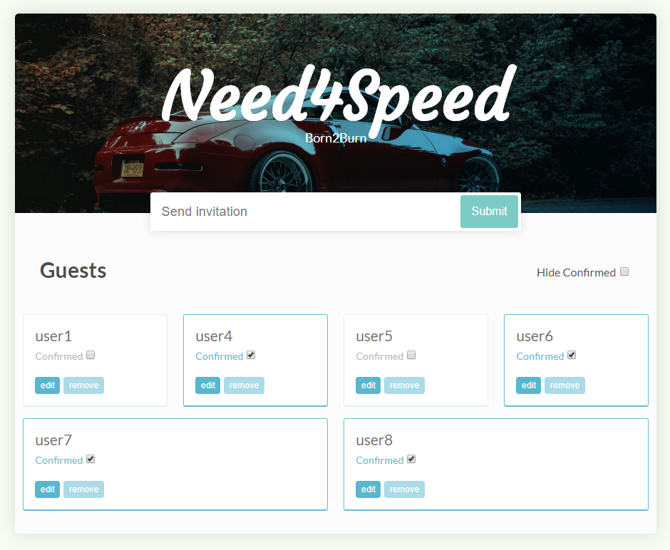

# Lista Invitación Need4Speed

_El objetivo es desarrollar una aplicación para controlar las invitaciones de un evento de coches, tiene un aspecto como el siguiente.
Lo más interesante que hemos conseguido en este proyecto es la sincronización con la BDD de Firebase._

### Tareas y Caracterisitcas 🔧

_Las tareas realizadas por cada uno de los miembros:_

 1. Cómo Administrador del evento, querría añadir invitados al evento. [**Carlos Asenjo**]
 2. Cómo Administrador del evento, querría poder confirmar invitados al evento. [**David Balboa**] && [**Carlos Asenjo**]
 3. Cómo Administrador del evento poder editar el nombre de cada asistente al evento. [**David Balboa**] && [**Carlos Asenjo**]
 4. Cómo Administrador del evento querría poder filtrar los invitados para mostrar solo los que tienen confirmada la asistencia. [**Carlos Asenjo**]
 5. Cómo Administrador del evento, querría poder eliminar invitados al evento [**David Balboa**]
 6. Cómo Administrador del evento me confirme antes de borrar un invitado al evento. [**David Balboa**]
 7. Cómo Administrador del evento querría que no se pudiera repetir el nombre de un invitado al evento (ni añadir uno vacio) [**David Balboa**]
 
 _Además se han realizado tareas adicionales:_
 
 1. Los nuevos invitados prevalecen en una base de datos.
 2. Se guardará la siguiente información de los invitados: Nombre, Confirmación. La cual se usará para saber si han confirmado cada uno de ellos.
 3. Al borrar un invitado se borra de la BDD también.
 4. Al modificar el nombre de un invitado se borra de la BDD.
 5. Al pulsar la tecla enter se agrega un nuevo invitado al evento.
 6. Si pulsamos la tecla enter en la ventana emergente de editar, también se actualiza el campo y la BDD.
 7. Se ha ajustado la vista responsive para que las tarjetas de los invitados se vean bien ordenadas en vista para dispositivos móviles.
 8. Se han creado Modal Box para editar los datos del invitado, confirmar si quieres borrar y para informar sobre un error a la hora de introducir el nombre.
 
 Se ha creado una base de datos en Firebase (https://firebase.google.com/). **Ver apartado Firebase para mas información de como se ha hecho esto**.

## Ejecutando las pruebas ⚙️

_Explica como ejecutar las pruebas automatizadas para este sistema_

## Firebase

_Hemos utilizado Firebase para la creación de la base de datos, y funciona de la siguiente manera:_

  - Firebase tiene un apartado el cual te permite crear un proyecto y añadirle una base de datos al mismo.
  - Permite la creación de una base de datos sin necesidad de PHP.
  - Esta BDD va vinculada a tu cuenta de Google.
  - Se sincroniza mediante consultas a la BDD.
  - La base de datos es actualizada instantaneamente cada vez que se agrega un nuevo invitado, se borra o se actualiza su nombre.

## Despliegue 📦

https://dwec-19-20.github.io/invitacionevento-crackheads/

## Autores ✒️

_Aquellos que ayudaron a levantar el proyecto desde sus inicios:_

* **Carlos Asenjo** - [itsnotlonee](https://github.com/itsnotLonee)
* **David Balboa** - [charlie](https://github.com/CarlosAsenjo)
